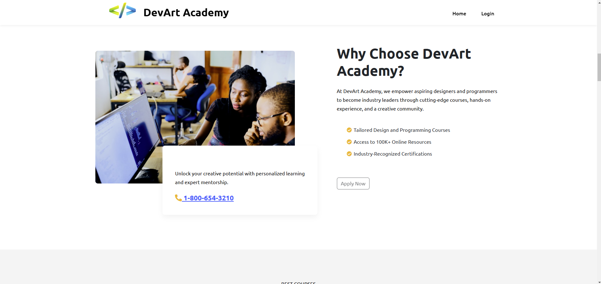
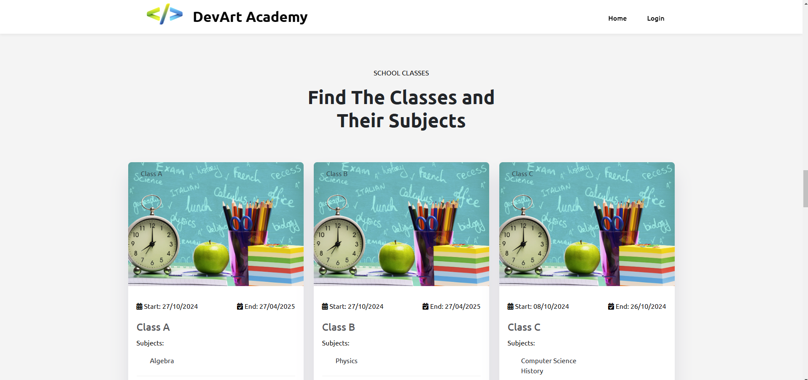
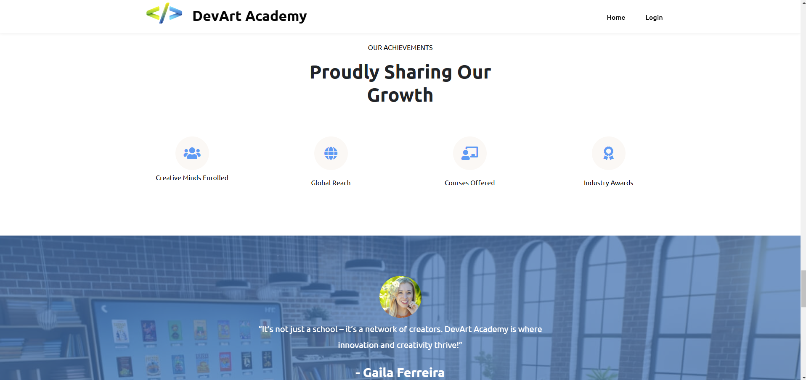
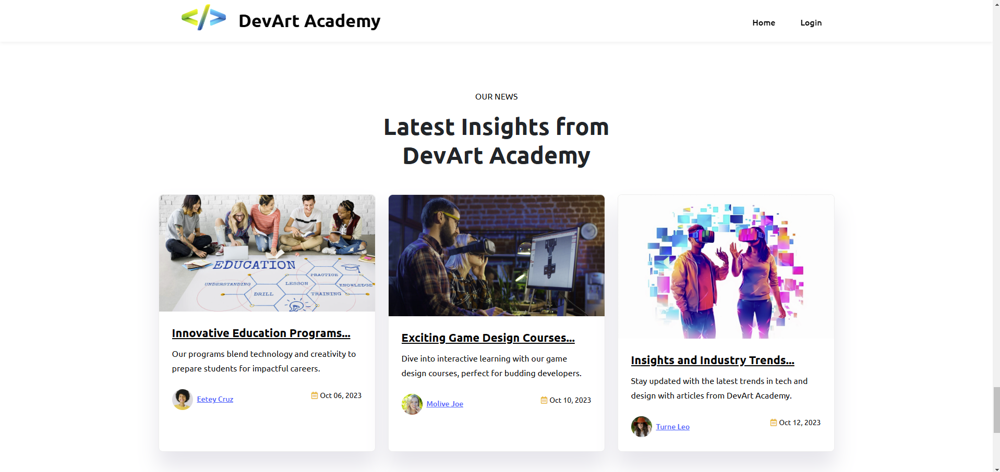
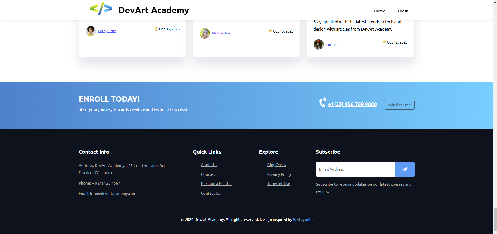

# School Management System 🎓

## About the Project
The **School Management System** is a web application developed using **ASP.NET Core MVC**. It provides an efficient and secure platform for managing students, teachers, courses, grades, and attendance within a school environment.

## Features 🚀
- **🔐 Authentication System**: Login, logout, registration, and password recovery via email.
- **✉️ Temporary Password**: Upon registration, a temporary password with random characters is sent to the user's email.
- **👥 Role Management**: Four user roles—Admin, Staff, Teacher, and Student.
- **🏫 Course and Subject Management**: Full CRUD operations for courses and subjects.
- **👨‍🏫 Teacher Management**: Complete CRUD operations for managing teachers.
- **📝 Student and Grades Management**: Manage students, classes, grades, and attendance.
- **📊 Admin Dashboard**: Alerts and system notifications from staff members.
- **🖼️ Profile Pictures**: Required for students and optional for other users.
- **🌐 Public API**: Provides data of all students in a specific class.
- **❌ Custom Error Handling**: Friendly error pages and complete CRUD error management.
- **🎨 Responsive UI**: Custom and original front-end design.

## User Roles and Permissions 🔑

| Feature                           | Admin | Staff | Teacher | Student | Anonymous |
|------------------------------------|-------|-------|---------|---------|-----------|
| **Login/Logout**                   | ✅    | ✅    | ✅      | ✅      | ❌        |
| **Create Accounts**                | ✅    | ❌    | ❌      | ❌      | ❌        |
| **CRUD Courses**                   | ✅    | ✅    | ❌      | ❌      | ❌        |
| **CRUD Subjects**                  | ✅    | ✅    | ❌      | ❌      | ❌        |
| **CRUD Teachers**                  | ✅    | ✅    | ❌      | ❌      | ❌        |
| **CRUD Students and Grades**       | ✅    | ✅    | ❌      | ❌      | ❌        |
| **View Courses and Subjects**      | ✅    | ✅    | ✅      | ✅      | ✅        |
| **View Grades and Status**         | ❌    | ❌    | ❌      | ✅      | ❌        |
| **Modify Profile**                 | ✅    | ✅    | ✅      | ✅      | ❌        |
| **Attendance Tracking and Management** | ✅  | ✅    | ✅      | ✅      | ❌        |

## Technologies Used 🛠️
- **Framework**: ASP.NET Core MVC
- **Database**: SQL Server with Entity Framework Core
- **Architecture**: Repository Pattern
- **Authentication**: Identity Framework with Role Management
- **Frontend**: Bootstrap, Syncfusion Controls
- **API**: RESTful Web API

## Visual Demonstration 🌟

### 🏠 Home Page


(SchoolManagementSystem-master/Home2.png)
















## Installation Instructions 💻
### Prerequisites
- **.NET SDK**: Download and install [ASP.NET Core SDK](https://dotnet.microsoft.com/download).
- **SQL Server**: Install [SQL Server](https://www.microsoft.com/en-us/sql-server/sql-server-downloads).
  
### Steps to Run Locally
1. Clone the repository:
    ```bash
    git clone https://github.com/yourusername/SchoolManagementSystem.git
    cd SchoolManagementSystem
    ```

2. Create the database and apply migrations:
    ```bash
    dotnet ef database update
    ```

3. Run the application:
    ```bash
    dotnet run
    ```

4. Open your browser and navigate to `https://localhost:5001`.

## License 📜
This project is licensed under the MIT License - see the [LICENSE](LICENSE) file for details.

## Contact 📬
For any inquiries, please contact me at:  
**Email**: [chammaroussama@gmail.com]  
**GitHub**: [https://github.com/yourusername](https://github.com/CHOUMR11/)
